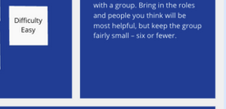
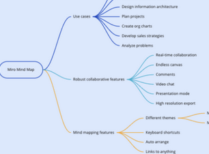

$$\begin{array}{c}10^{-3} \\ 25^{+4} \\ (  0.96)   \end{array}$$

Put specific - e.g., "How can we make creating java issues than: "How can we improve java issues?"

## 10

### 1

10

on on in the middle of the board,

${ }^{24,350}$

### 1

10

$$\begin{array}{l}\text { ffp: } \\ \text { branch out }\end{array}$$

## 1

### $$\text { Stem:1 }$$

$$\begin{array}{c}\text { Grab the gold coins } \\ \text { Grade the gold coins }\end{array}$$

Go back over your mind map and highlight the ideas that with you, is there anything missing: Oz are there ideas wfurther? With any luck, yooh! have hit upon one or two ideas that

$$\begin{aligned} \\ & =\frac{1}{2}(-3)^{2}+\frac{1}{4}(-3)^{2}, \\ \\ & =\frac{1}{2}(-3)^{2}+\frac{1}{2}(-3)^{2} ; \\ \end{aligned}$$

